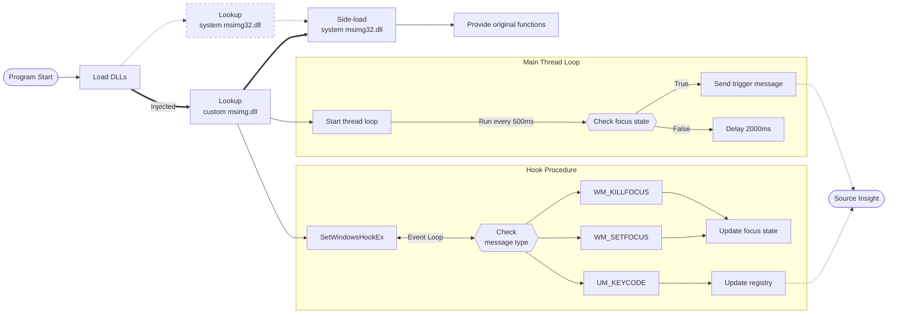

# si-coding-hook

## Overview

This is a simple Windows DLL that hooks into the Windows message queue and listens for WM_KILLFOCUS, WM_SETFOCUS, and
UM_KEYCODE messages. When it receives a WM_KILLFOCUS message, it will update the registry to indicate that the user is
no longer focused on the application. When it receives a WM_SETFOCUS message, it will update the registry to indicate
that the user is focused on the application. When it receives a UM_KEYCODE message, it will update the registry to
indicate that the user has pressed a key.

## Design

